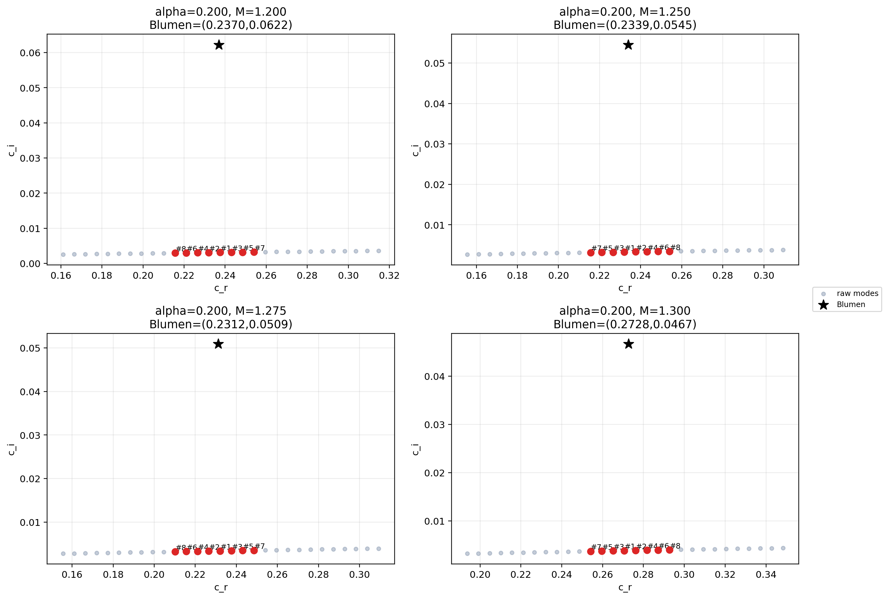
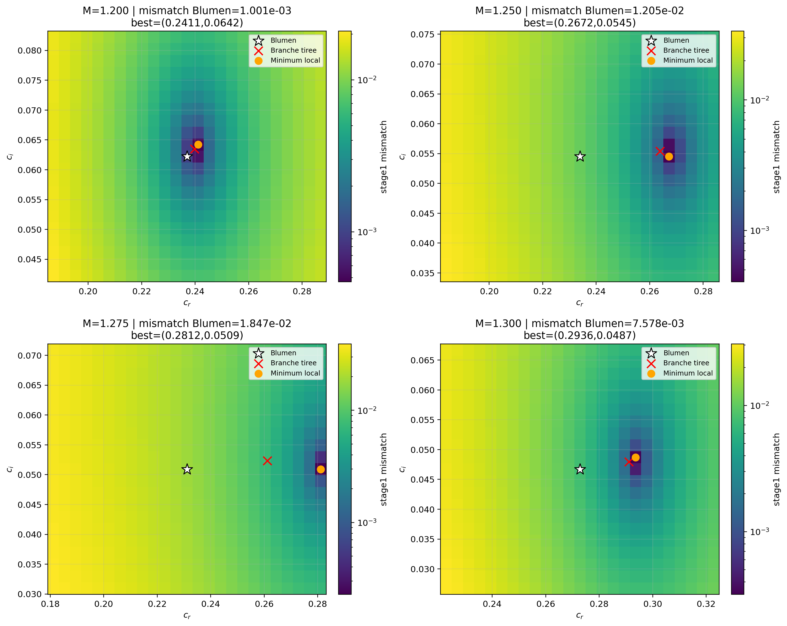
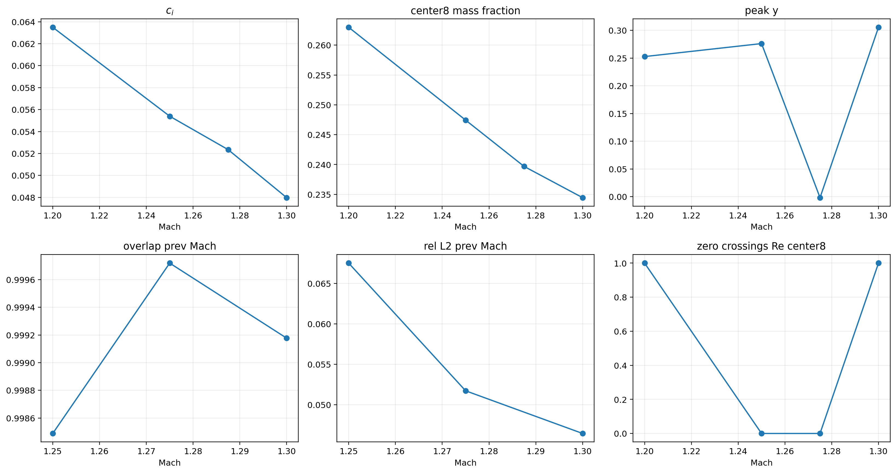
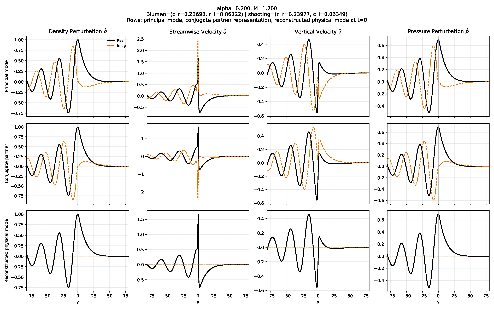
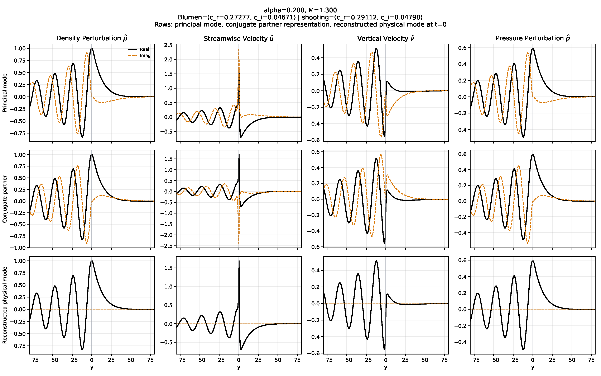
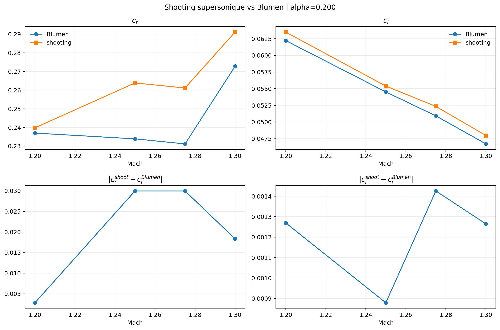

# Problèmes supersoniques

## Objet du document

Ce document rassemble l'état actuel du travail sur le solveur **classique supersonique** pour l'instabilité de Kelvin-Helmholtz compressible. L'objectif est double :

1. exposer clairement ce qui a été tenté jusqu'ici ;
2. isoler les points de blocage scientifiques et numériques à discuter.

Le besoin immédiat est de pouvoir discuter avec le directeur de thèse :

- de ce qui a réellement été validé ;
- de ce qui a échoué ;
- de ce qui reste ambigu, en particulier sur `c_r` ;
- et des hypothèses possibles pour expliquer pourquoi Blumen a pu tracer des courbes que nous ne retrouvons pas intégralement avec la chaîne actuelle.

Ce document ne prétend pas être une note finale. C'est un **dossier de travail complet**.

## Bibliothèques et environnement numérique

Les solveurs et les audits supersoniques s'appuient principalement sur :

- `numpy` pour les tableaux, les interpolations et les opérations complexes ;
- `scipy.integrate.solve_ivp` pour l'intégration des trajectoires de tir ;
- `scipy.optimize.minimize` et `scipy.optimize.minimize_scalar` pour l'identification de `c_r`, `c_i` et du raccord d'amplitude ;
- `scipy.linalg.eig` pour la diagonalisation dense du GEP ;
- `scipy.sparse` pour l'assemblage par blocs des matrices `A` et `B` du GEP ;
- `pandas` pour l'agrégation des audits ;
- `matplotlib` pour les figures de spectre, de mismatch et de validation visuelle.

En pratique :

- les smoke tests ont été faits localement ;
- les calculs supersoniques lourds ont été lancés sur Jean Zay ;
- les runs de solveur classique sont essentiellement des jobs CPU ;
- les GPUs ont surtout servi aux expériences PINN, pas au solveur classique supersonique.

## État actuel en une page

### Ce qui est solide aujourd'hui

- le **shooting supersonique** retrouve une branche instable cohérente à `alpha = 0.2` pour `M = 1.20, 1.25, 1.275, 1.30` ;
- cette branche reproduit bien `c_i` de Blumen ;
- elle est cohérente avec ses propres conditions asymptotiques ;
- elle est continue en `Mach` et donne une structure modale visuellement crédible ;
- le **GEP dense actuel** ne retrouve pas la bonne croissance `c_i` et ne peut donc pas servir de solveur classique de référence.

### Ce qui reste ouvert

- l'écart résiduel sur `c_r` entre shooting et Blumen ;
- la question de savoir si cet écart vient :
  - de notre formulation,
  - des conditions aux bords,
  - de la sélection de branche,
  - ou de la **faible robustesse locale de la référence Blumen en `c_r`** ;
- la compréhension fine du champ `\hat u`, qui présente un pic très aigu au centre dans la reconstruction visuelle du shooting ;
- la validation visuelle des reconstructions globales d'isolignes `c_i` et `c_r`, encore en cours de recalcul après correction du parseur de courbes.

### Décision de travail actuellement retenue

- **solveur classique de référence supersonique** : shooting ;
- **quantité principale de validation** : `c_i` ;
- **quantité secondaire de validation** : structure modale et continuité de branche ;
- **`c_r`** : comparaison utile, mais à interpréter avec prudence tant que l'incertitude locale sur la digitalisation Blumen n'est pas levée plus proprement.

## Problème physique résolu

### Référence Blumen

La référence théorique et numérique visée est celle de Blumen (1970, 1975) pour une couche de cisaillement inviscide compressible 2D de profil de vitesse :

```math
U(y) = \tanh(y).
```

Les perturbations sont cherchées sous la forme :

```math
q'(x,y,t) = \hat q(y)\,\exp\bigl(i\alpha(x-ct)\bigr),
```

avec :

- `\alpha` le nombre d'onde réel ;
- `c = c_r + i c_i` la vitesse de phase complexe ;
- `\omega_i = \alpha c_i` le taux de croissance temporel.

Dans toute la suite :

- `c_i > 0` signifie instabilité ;
- les figures de Blumen supersoniques utilisées ici sont interprétées comme des courbes en `c_r` et `c_i`, **pas** en `\omega_i`.

### Forme de l'équation effectivement utilisée dans le shooting

Le shooting supersonique actuel travaille sur une formulation de type équation de pression, puis sur sa version de Riccati.

Dans [classical_solver/supersonic/shooting_supersonic.py](classical_solver/supersonic/shooting_supersonic.py), la variable principale est :

```math
\gamma(y) = \frac{\hat p'(y)}{\hat p(y)}.
```

Le solveur utilise la forme :

```math
\gamma' = -\gamma^2 - P(y)\gamma + \alpha^2 R(y),
```

avec :

```math
P(y) = -\frac{2U'(y)}{U(y)-c}, \qquad
R(y) = 1 - M^2(U(y)-c)^2.
```

L'équation scalaire sous-jacente pour `\hat p` s'écrit donc :

```math
\hat p'' - \frac{2U'}{U-c}\hat p' - \alpha^2\bigl[1 - M^2(U-c)^2\bigr]\hat p = 0.
```

Cette forme est cohérente avec la structure standard de l'analyse temporelle compressible de Blumen pour la couche `tanh`.

### Ce qu'on résout exactement avec chaque solveur

Il faut distinguer soigneusement les objets numériques manipulés.

#### Tir / shooting

Le tir résout un **problème spectral local** à `(\alpha, M)` fixé :

- on fixe `alpha` ;
- on fixe `Mach` ;
- on cherche une eigenvaleur complexe `c = c_r + i c_i` ;
- puis on reconstruit le mode associé.

Le tir ne construit donc pas directement une surface globale `c(\alpha, M)` :

- il résout d'abord des cas ponctuels ;
- puis on raccorde ces cas ponctuels par continuation, multi-start ou tracking.

#### GEP

Le GEP résout un **problème spectral discrétisé sur domaine tronqué** :

- à `(\alpha, M)` fixé ;
- sur une grille finie en `\xi` puis en `y` ;
- avec des conditions aux bords discrètes ;
- et il renvoie un nuage de modes qu'il faut filtrer et classer.

La difficulté du GEP n'est donc pas seulement “résoudre une eigenvaleur”, mais aussi :

- isoler la bonne branche parmi de nombreux modes finis ;
- et vérifier que la formulation discrète contient bien la famille physique recherchée.

### Conditions asymptotiques et sélection de branche

Le solveur ne travaille pas sur un domaine vraiment infini, mais reconstruit les conditions de départ à gauche et à droite à partir des comportements asymptotiques associés aux états uniformes :

- `U(-\infty) = -1`
- `U(+\infty) = +1`

Les racines asymptotiques utilisées sont construites à partir de :

```math
1 - M^2(c+1)^2 \quad \text{et} \quad 1 - M^2(c-1)^2.
```

La branche est ensuite suivie en imposant :

- un raccord au point `y = 0` ;
- un mismatch minimal sur `\gamma = \hat p'/\hat p` ;
- et, selon les scripts, une continuation depuis le Mach précédent ou plusieurs graines autour d'une cible donnée.

Dans la variante `mstab17`, la même logique est reformulée sur un système réel :

```math
[\kappa, q, \ln|p|, \phi], \qquad \gamma = \kappa + iq,
```

ce qui permet de séparer :

- un **stage 1** de raccord spectral sur les variables de Riccati ;
- puis un **stage 2** de raccord d'amplitude sur `|p|`.

## Solveurs mis en place

## 1. Shooting supersonique

En pratique, deux implémentations apparentées du tir ont été utilisées.

### Implémentation A : Riccati direct sur la pression

- [classical_solver/supersonic/shooting_supersonic.py](classical_solver/supersonic/shooting_supersonic.py)

Cette version :

- travaille directement avec `\gamma = \hat p'/\hat p` ;
- intègre la Riccati complexe ;
- estime automatiquement la taille de boîte ;
- sert principalement pour les cartes de croissance et les reconstructions globales d'isolignes.

### Fichier principal

- [classical_solver/supersonic/shooting_supersonic.py](classical_solver/supersonic/shooting_supersonic.py)

### Implémentation B : solveur type `mstab17`

- [classical_solver/supersonic/mstab17_supersonic_solver.py](classical_solver/supersonic/mstab17_supersonic_solver.py)

Cette version :

- intègre un système réel `[kappa, q, ln|p|, phi]` ;
- cherche `c_r, c_i` par minimisation du mismatch spectral ;
- ajuste ensuite l'amplitude de la branche droite ;
- sert beaucoup dans les audits fins de structure modale et de validation visuelle.

Les deux approches restent des méthodes de tir, mais :

- elles ne manipulent pas les mêmes variables internes ;
- elles n'utilisent pas exactement le même critère intermédiaire de succès ;
- elles sont donc complémentaires dans le diagnostic.

### Choix numériques

- résolution de l'eigenvaleur directement en `c = c_r + i c_i` ;
- contrainte `c_r \ge 0`, `c_i > 0` ;
- intégration par `solve_ivp` ;
- minimisation par `Powell` ;
- domaine adaptatif borné entre :
  - `min_domain_size = 8`
  - `max_domain_size = 80`
- point de raccord :
  - `match_point = 0`.

Dans `mstab17_supersonic_solver.py`, les paramètres utilisés dans la plupart des audits sont :

- `match_y = 1.0` ;
- `ln_p_start_left = -5.0` ;
- `min_y_limit = 10.0` ;
- `max_y_limit = 80.0` ;
- `rtol = 1e-10` ;
- `atol = 1e-12`.

### Taille de boîte

La taille de boîte est **estimée automatiquement** à partir des longueurs de décroissance/rayonnement asymptotiques, puis tronquée dans `[8, 80]`.

Conséquence :

- le shooting ne dépend pas d'une taille de boîte fixe unique ;
- mais les diagnostics visuels montrent que, sur les cas audités, la branche trouvée exploite en pratique toute la fenêtre `[-80,80]`.

### Conditions initiales et “conditions de bord” côté shooting

Le tir n'impose pas des conditions de bord au sens GEP. Il impose des **conditions initiales asymptotiques** :

- à gauche, une branche compatible avec le far field `U \to -1` ;
- à droite, une branche compatible avec le far field `U \to +1`.

Dans le code Riccati, cela revient à construire :

- `gamma_left = alpha * sqrt(1 - M^2(c+1)^2)` ;
- `gamma_right = -alpha * sqrt(1 - M^2(c-1)^2)` ;

avec choix de la racine principale puis correction du signe pour garder la branche décroissante / radiative retenue.

Ensuite :

- on part de `y = -L` et de `y = +L` ;
- on intègre jusqu'au point de raccord ;
- on minimise `|gamma_left(match) - gamma_right(match)|`.

Dans `mstab17`, le même principe est séparé explicitement en deux étapes :

- `stage1_mismatch` : raccord spectral sur `kappa, q` ;
- `stage2_mismatch` : raccord d'amplitude.

### Graines initiales utilisées par le tir Riccati

Le solveur `shooting_supersonic.py` n'utilise pas une seule graine spectrale. Il combine :

- continuation depuis l'`alpha` précédent ;
- continuation depuis le `Mach` précédent ;
- point d'ancrage le plus proche dans un nuage de références ;
- graines manuelles du type :
  - `(0.00, 0.02)`
  - `(0.02, 0.02)`
  - `(0.04, 0.03)`
  - `(0.06, 0.05)`
  - `(0.08, 0.08)`
- et petites perturbations autour des graines déjà connues.

Donc, quand le tir ne retombe pas exactement sur Blumen, ce n'est pas parce qu'il n'aurait essayé qu'un seul point de départ.

### Variantes testées

- continuation simple en `Mach` ;
- multi-start autour d'une cible Blumen ;
- continuation avec poids de tracking ;
- comparaison directe contre des familles GEP locales ;
- audit d'eigenconditions au point Blumen ;
- audit de structure modale ;
- audit visuel complet `rho,u,v,p`.

## 2. GEP dense

### Fichier principal

- [classical_solver/gep/dense_gep_notebook_style.py](classical_solver/gep/dense_gep_notebook_style.py)

### Formulation

Le GEP est une formulation en variables primitives, construite sur une grille auxiliaire uniforme `\xi`, puis transportée en `y` via le mapping :

```math
y = L \frac{\xi}{1-\xi^2}.
```

Le solveur :

- construit les blocs `A` et `B` du problème généralisé ;
- impose `v = 0` aux bords par élimination de degrés de liberté ;
- diagonalise densément avec `scipy.linalg.eig`.

La forme algébrique effectivement résolue est :

```math
A q = c\, B q,
```

avec :

```math
q = [\hat u,\hat v,\hat p]^T.
```

Dans le code actuel, les trois lignes correspondent schématiquement à :

```math
\rho\, i\alpha \hat u + \rho\, \partial_y \hat v + \frac{i\alpha}{a^2} U \hat p
=
c\, \frac{i\alpha}{a^2}\hat p,
```

```math
\rho\, i\alpha U \hat u + \rho\, U' \hat v + i\alpha \hat p
=
c\, \rho\, i\alpha \hat u,
```

```math
\rho\, i\alpha U \hat v + \partial_y \hat p
=
c\, \rho\, i\alpha \hat v.
```

Autrement dit :

- l'eigenvaleur du GEP est directement `c` ;
- `\omega_i` n'est pas calculé indépendamment, mais reconstruit ensuite par `\omega_i = \alpha c_i`.

Les inconnues sont organisées par blocs :

- `u`
- `v`
- `p`

sur `N = n_points` points. Le problème initial est donc de taille `3N x 3N` avant élimination des degrés de liberté contraints.

### Maillage et discrétisation du GEP

Le maillage est :

- uniforme en `\xi` dans `[-\xi_{\max}, \xi_{\max}]` ;
- non uniforme en `y` après mapping ;
- discrétisé par matrice de différences finies :
  - schéma centré à l'intérieur ;
  - schéma décentré d'ordre 1 aux bords.

La dérivée en `y` est obtenue à partir de la dérivée en `\xi` et du facteur métrique `d\xi/dy`.

### Paramètres courants

- configuration par défaut :
  - `n_points = 301`
  - `mapping_scale = 5.0`
  - `xi_max = 0.98`
- audit local haute résolution près de Blumen :
  - `n_points = 1001`
  - `mapping_scale = 1.5`
  - `xi_max = 0.90`

Des variantes locales ont aussi été testées avec :

- `mapping_kind = pin`
- `mapping_kind = cubic`
- `cubic_delta = 0.2`

### Taille de boîte effective

Avec le mapping `y = L\xi/(1-\xi^2)` :

- pour `L = 5.0`, `xi_max = 0.98`, on a une extension très large en `y` ;
- pour l'audit local `L = 1.5`, `xi_max = 0.90`, on a une boîte effective beaucoup plus resserrée, de l'ordre de `|y| \approx 7.1`.

Le GEP et le shooting ne voient donc pas exactement le même type de troncature spatiale.

### Conditions de bord du GEP

Le point critique du GEP actuel est ici :

- on élimine les degrés de liberté correspondant à `v = 0` aux deux bords ;
- on résout donc un problème fermé artificiellement sur une boîte tronquée ;
- on n'impose pas explicitement une condition radiative de type onde sortante.

Conséquence :

- la formulation peut rester acceptable en subsonique ;
- mais elle est potentiellement beaucoup plus discutable en supersonique, où une partie du mode est rayonnante.

## Ce qui a été fait jusqu'à maintenant

## 1. Digitalisation et calibration Blumen

### Travail effectué

- relecture et nettoyage des points digitalisés supersoniques ;
- clarification du fait que les figures supersoniques sont en `c_r` et `c_i` ;
- correction d'un décalage de calibration de l'axe Mach dans [classical_solver/supersonic/blumen_reference.py](classical_solver/supersonic/blumen_reference.py) ;
- centralisation des courbes dans :
  - `KH_RT_Blumen/supersonic/ci_datasets.csv`
  - `KH_RT_Blumen/supersonic/cr_datasets.csv`.

### Problèmes rencontrés

- confusion initiale entre `c_i` et `\omega_i` ;
- structure des CSV agrégés `ci_datasets.csv` / `cr_datasets.csv` plus subtile que prévu ;
- bug récent dans la reconstruction visuelle :
  - les niveaux numériques de `cr_datasets.csv` étaient lus comme des isolignes `c_i`,
  - ce qui produisait à tort des isolignes verticales dans la figure `c_i`.

Ce point a été corrigé dans [classical_solver/supersonic/blumen_reference.py](classical_solver/supersonic/blumen_reference.py), mais les figures globales `c_i` et `c_r` doivent encore être relancées proprement après cette correction.

## 1 bis. Types de calculs effectués

Les calculs supersoniques réalisés jusqu'ici se répartissent en plusieurs familles.

### A. Spectres GEP locaux

But :

- regarder le nuage brut de modes à `\alpha, M` fixés ;
- vérifier si la branche de Blumen existe déjà avant tout post-traitement.

### B. Sélection / tracking de branche GEP

But :

- prendre le nuage brut du GEP ;
- appliquer des critères de proximité, de continuité ou d'overlap ;
- tester si une famille physique stable se dégage.

### C. Tir ponctuel

But :

- résoudre proprement un cas `(\alpha, M)` ;
- obtenir `c_r`, `c_i` et le mode correspondant ;
- vérifier la cohérence asymptotique.

### D. Continuation et multi-start

But :

- propager une branche d'un `Mach` au suivant ;
- vérifier qu'on ne saute pas de famille ;
- ou tester si le point Blumen est récupérable avec de meilleures graines.

### E. Audits de référence Blumen

But :

- mesurer la robustesse réelle de la digitalisation ;
- séparer ce qui vient du solveur de ce qui vient de la faiblesse de la référence.

### F. Audits modaux et visuels

But :

- ne pas s'arrêter aux seules eigenvaleurs ;
- vérifier si la structure physique du mode est crédible.

## 2. Exploration GEP

### Ce qui a été tenté

- balayages GEP locaux et globaux ;
- base de données de modes ;
- sélection “branche la plus instable” ;
- sélection “branche la plus proche de Blumen” ;
- continuation guidée ;
- beam search ;
- clustering de familles ;
- comparaison GEP vs shooting ;
- audit direct du spectre brut près des points Blumen.

### Scripts principaux utilisés

- [scripts/run_supersonic_gep_blumen_guided_sweep.py](scripts/run_supersonic_gep_blumen_guided_sweep.py)
- [scripts/diagnose_supersonic_candidate_modes_near_blumen.py](scripts/diagnose_supersonic_candidate_modes_near_blumen.py)
- [scripts/diagnose_supersonic_raw_spectrum_vs_blumen.py](scripts/diagnose_supersonic_raw_spectrum_vs_blumen.py)
- [scripts/compare_supersonic_gep_candidates_vs_shooting.py](scripts/compare_supersonic_gep_candidates_vs_shooting.py)
- [scripts/cluster_supersonic_mode_families.py](scripts/cluster_supersonic_mode_families.py)
- [scripts/track_supersonic_branch_beam_search.py](scripts/track_supersonic_branch_beam_search.py)

### Résultat principal

Le GEP dense actuel ne fait **pas** apparaître, dans le spectre brut exploité, une famille proche de Blumen simultanément en `c_r` **et** en `c_i`.

Le signal le plus fort vient de l'audit local brut :

| `alpha=0.2` | `Mach` | meilleur candidat GEP en `c_r` | `c_i` de ce candidat | `c_i` Blumen |
| --- | --- | --- | --- | --- |
| cas 1 | 1.20 | `c_r = 0.2375` | `c_i = 0.0031` | `0.0622` |
| cas 2 | 1.25 | `c_r = 0.2321` | `c_i = 0.0033` | `0.0545` |
| cas 3 | 1.275 | `c_r = 0.2321` | `c_i = 0.0034` | `0.0509` |
| cas 4 | 1.30 | `c_r = 0.2706` | `c_i = 0.0038` | `0.0467` |

Conclusion :

- le GEP peut produire des candidats raisonnables en `c_r` ;
- mais leur croissance `c_i` est **un ordre de grandeur trop faible** ;
- la difficulté n'est donc plus un simple problème de ranking de modes.

### Ce qui ne fonctionne pas concrètement dans le GEP

- prendre le mode le plus instable ne donne pas la bonne famille ;
- prendre le mode le plus proche de Blumen ne répare pas `c_i` ;
- prendre le mode le plus proche du shooting ne répare pas non plus `c_i` ;
- augmenter `N` ne fait pas apparaître spontanément la bonne branche ;
- jouer localement sur `mapping_scale` et `xi_max` modifie le spectre, mais ne fait pas émerger la branche fortement instable attendue.

### Illustration

**Spectre local brut du GEP près de Blumen**



Lecture :

- beaucoup de modes bruts existent ;
- mais aucun ne combine le bon `c_r` **et** le bon `c_i` dans la boîte locale auditée ;
- la branche fortement instable attendue n'est pas visible comme candidat brut évident.

## 3. Exploration shooting

### Ce qui a été tenté

- continuation en `Mach` ;
- multi-start autour des points Blumen ;
- continuation avec poids de tracking ;
- audit mismatch local autour des points Blumen ;
- audit de structure modale ;
- audit visuel complet `rho,u,v,p`.

### Scripts principaux utilisés

- [scripts/track_supersonic_shooting_mach_continuation.py](scripts/track_supersonic_shooting_mach_continuation.py)
- [scripts/track_supersonic_shooting_multistart.py](scripts/track_supersonic_shooting_multistart.py)
- [scripts/audit_supersonic_blumen_eigenconditions.py](scripts/audit_supersonic_blumen_eigenconditions.py)
- [scripts/audit_supersonic_shooting_ci_map.py](scripts/audit_supersonic_shooting_ci_map.py)
- [scripts/audit_supersonic_shooting_mode_structure.py](scripts/audit_supersonic_shooting_mode_structure.py)
- [scripts/audit_supersonic_shooting_visual_validation.py](scripts/audit_supersonic_shooting_visual_validation.py)

### Résultat principal

Le shooting retrouve une branche instable **cohérente et robuste** sur la ligne :

- `alpha = 0.2`
- `M = 1.20, 1.25, 1.275, 1.30`

### Ce qui a été calculé avec le shooting

Le shooting n'a pas seulement servi à produire quatre points isolés.

On l'a utilisé pour :

- suivre une branche en `Mach` ;
- produire des cartes locales `c_i(\alpha, M)` ;
- comparer les eigenvaleurs à Blumen ;
- auditer les conditions asymptotiques ;
- reconstruire les champs `rho, u, v, p` ;
- reconstruire un mode principal, un partenaire conjugué et le mode physique à `t = 0`.

### Reconstruction des champs à partir du shooting

Le shooting travaille d'abord sur `\hat p` et `\gamma = \hat p'/\hat p`, puis reconstruit les variables primitives a posteriori.

Dans [scripts/audit_supersonic_shooting_visual_validation.py](scripts/audit_supersonic_shooting_visual_validation.py), les champs sont reconstruits par :

```math
\hat p_y = \gamma \hat p,
```

```math
\hat v = -\frac{\hat p_y}{i\alpha(U-c)},
```

```math
\hat u = -\frac{U'\hat v + i\alpha \hat p}{i\alpha(U-c)},
```

```math
\hat \rho = M^2 \hat p.
```

Puis :

- tous les champs sont rephasés par rapport au maximum de `\hat\rho` ;
- une normalisation commune est appliquée ;
- on construit ensuite :
  - le mode principal,
  - une représentation du partenaire conjugué,
  - et le mode physique reconstruit à `t=0`.

Ce point est important pour la discussion, parce qu'il sépare clairement :

- la qualité du **solveur spectral** lui-même ;
- et la qualité de la **reconstruction des variables primitives** à partir de `\hat p`.

## Ce qui a échoué, et pourquoi

## 1. Le GEP n'a pas produit la bonne croissance

### Fait observé

Les meilleurs candidats GEP locaux proches de Blumen en `c_r` restent bloqués vers `c_i \approx 0.003-0.004`, alors que Blumen et le shooting donnent `c_i \approx 0.047-0.063`.

### Interprétation

Le problème n'est donc pas :

- “on sélectionne mal la bonne branche dans un spectre qui la contient clairement”.

Le problème est plutôt :

- “la formulation GEP actuelle, avec ses conditions aux bords et sa troncature, ne montre pas clairement la branche instable recherchée dans le spectre brut exploité”.

### Causes plausibles

- conditions aux bords du GEP (`v = 0`) probablement trop éloignées des conditions radiatives attendues en supersonique ;
- troncature spatiale et mapping susceptibles de déformer les branches rayonnantes ;
- branche réellement absente du spectre résolu avec cette formulation ;
- ou, plus prudemment, branche présente mais trop mal résolue / trop contaminée pour être identifiable par les sélecteurs testés.

Il faut aussi ajouter un point plus concret :

- le GEP est un calcul “one shot” de grand spectre sur boîte tronquée ;
- le shooting, lui, résout explicitement un problème de raccord de branche asymptotique ;
- donc les deux méthodes ne portent pas exactement la même information sur la physique radiative.

Autrement dit, l'échec du GEP n'est pas seulement un échec algorithmique ; il peut refléter une différence plus profonde entre :

- “calculer tout un spectre fermé sur boîte finie” ;
- et “suivre une branche ouverte/radiative choisie par des conditions asymptotiques”.

En termes de discussion scientifique, c'est probablement le point central du dossier :

- soit la branche de Blumen devrait sortir d'un GEP bien posé de ce type, et alors notre formulation / nos bords sont en cause ;
- soit cette branche est numériquement difficile à faire apparaître sans traitement radiatif plus explicite, et l'échec actuel devient compréhensible.

## 2. Les sélecteurs de branche GEP n'ont pas réparé le problème

### Fait observé

Les variantes :

- guided sweep,
- branch continuation,
- beam search,
- clustering de familles,
- proximité shooting,
- proximité Blumen,

ne réparent pas le défaut sur `c_i`.

### Interprétation

Le verrou ne se situe plus au niveau du **classement** des modes, mais au niveau :

- de la **présence** de la bonne branche dans le spectre calculé ;
- ou de la **compatibilité physique** entre le GEP actuel et la branche de Blumen.

## 3. Le shooting multi-start n'a pas fermé l'écart sur `c_r`

### Fait observé

Le multi-start n'a pas ramené la solution shooting exactement sur les `c_r` de Blumen :

- `M=1.25` : `\Delta c_r \approx 0.030`
- `M=1.275` : `\Delta c_r \approx 0.030`
- `M=1.30` : `\Delta c_r \approx 0.018`

### Pourquoi ce n'est pas forcément un échec du solveur

L'audit d'eigenconditions montre que :

- le minimum local du mismatch près de Blumen se déplace **principalement en `c_r`** ;
- `c_i` reste quasiment à la bonne valeur ;
- et le mismatch au point Blumen n'est pas catastrophique, mais n'est pas le minimum local préféré par la formulation.

Illustration :



Lecture :

- le décalage n'est pas isotrope ;
- la vallée de mismatch dérive surtout horizontalement en `c_r` ;
- cela suggère un désaccord fin sur la branche ou sur la référence, plutôt qu'un échec brut de croissance.

Autrement dit :

- le shooting ne rate pas la croissance ;
- le shooting ne rate pas sa propre cohérence asymptotique ;
- il préfère simplement un `c_r` légèrement décalé par rapport à la lecture digitalisée locale de Blumen.

## 4. La référence `c_r` de Blumen est fragile localement

### Fait observé

L'audit local de la référence digitalisée montre que `c_r` est **beaucoup moins contraint** que `c_i` autour de `alpha = 0.2`.

Pour `c_r` :

- `M=1.25` : `bracket_alpha_span = 0.139`
- `M=1.275` : `bracket_alpha_span = 0.175`
- `M=1.30` : `bracket_alpha_span = 0.157`

avec peu de points locaux sur les niveaux encadrants.

Pour `c_i` :

- `bracket_alpha_span \approx 0.042-0.044`
- 13 à 16 points locaux utiles ;
- niveaux plus denses et plus proches du point cible.

### Interprétation

Le `c_r` digitalisé n'est probablement **pas** une vérité ponctuelle aussi robuste que `c_i` sur cette zone.

Conséquence méthodologique :

- `c_i` peut servir de benchmark fort ;
- `c_r` doit être utilisé avec plus de prudence, surtout si l'écart est de l'ordre de quelques `10^{-2}`.

## Pourquoi on s'appuie davantage sur `c_i` que sur `c_r`

### Raison physique

`c_i` mesure directement la croissance instable.

Si un solveur donne :

- un `c_r` plausible ;
- mais un `c_i` trop faible d'un ordre de grandeur,

alors il ne capture pas la bonne branche instable.

### Raison numérique

La digitalisation locale montre que :

- `c_i` est mieux contraint graphiquement ;
- `c_r` repose sur des brackets plus larges et des niveaux plus clairsemés.

### Raison pratique

Dans tous les tests effectués :

- le shooting est bon sur `c_i` ;
- le GEP échoue d'abord sur `c_i` ;
- le désaccord difficile à interpréter est surtout sur `c_r`.

Donc :

- `c_i` est la quantité la plus discriminante pour juger un solveur supersonique ;
- `c_r` reste utile, mais comme comparaison secondaire.

## Ce qu'on a validé sur le shooting

## 1. Reproduction de `c_i`

À `alpha = 0.2` :

| `Mach` | `c_i` Blumen | `c_i` shooting | erreur absolue |
| --- | --- | --- | --- |
| 1.20 | 0.062223 | 0.063492 | 0.001270 |
| 1.25 | 0.054514 | 0.055393 | 0.000879 |
| 1.275 | 0.050920 | 0.052346 | 0.001426 |
| 1.30 | 0.046711 | 0.047976 | 0.001265 |

Conclusion :

- l'accord sur `c_i` est bon ;
- il s'agit aujourd'hui de la validation quantitative la plus robuste du solveur supersonique.

## 2. Continuité modale en `Mach`

L'audit de structure modale donne :

- `overlap_prev_mach_center8 = 0.9985, 0.9997, 0.9992`
- `rel_l2_prev_mach_center8 = 0.0675, 0.0517, 0.0464`

Conclusion :

- on suit bien une même famille modale ;
- il n'y a pas de saut de branche visible entre `M=1.20` et `M=1.30`.

Illustration :



## 3. Validation visuelle des champs

La validation visuelle complète du shooting montre :

- un cœur modal localisé près de la couche ;
- une queue oscillante / rayonnante d'un côté ;
- une décroissance nette de l'autre ;
- une cohérence d'ensemble entre `\hat\rho`, `\hat u`, `\hat v`, `\hat p`.

Illustrations issues du PDF de validation visuelle :

**Exemple de page 1**



**Exemple de page 4**



Cette validation est suffisante pour considérer que, sur la branche dominante auditée, le shooting reconstruit un mode physiquement crédible.

Le mode dominant reconstruit par le shooting a donc passé trois niveaux de validation :

- validation spectrale sur `c_i` ;
- validation de continuité modale en `Mach` ;
- validation visuelle des champs reconstruits.

## Ce qui pose encore problème dans la reconstruction modale

## 1. Côté GEP

### Problème

Même lorsque `c_r` paraît plausible, les modes GEP extraits sont associés à une croissance `c_i` trop faible.

### Conséquence

La reconstruction modale GEP n'est pas interprétable comme une approximation fiable du mode instable dominant recherché.

Autrement dit :

- le problème n'est pas seulement “la bonne eigenvaleur n'est pas parfaitement triée” ;
- c'est surtout que la famille modale visée n'est pas capturée comme il faut dans la formulation GEP actuelle.

## 2. Côté shooting

### Problème

La reconstruction visuelle du shooting est globalement bonne, mais un point mérite d'être signalé :

- le champ `\hat u` présente un pic très aigu au voisinage de `y = 0`.

### Interprétations possibles

- effet de normalisation ;
- effet physique réel lié à la reconstruction choisie ;
- conséquence de la variable principale utilisée (`p`) puis des champs dérivés ;
- ou symptôme d'une reconstruction encore un peu fragile, même si le reste du mode est cohérent.

Ce point n'invalide pas la branche, mais mérite d'être discuté.

Il peut en particulier indiquer :

- une échelle relative mal équilibrée entre les champs ;
- une forte sensibilité de `u` à la dérivation de `p` ;
- ou une difficulté plus structurelle dans la reconstruction des variables primitives depuis la pression.

Il faut donc distinguer deux niveaux de difficulté :

1. **identification de la bonne eigenvaleur** ;
2. **reconstruction stable de tous les champs associés**.

Sur la ligne auditée, le shooting semble bon sur le point 1, et raisonnablement bon sur le point 2, mais pas parfaitement verrouillé sur `\hat u`.

## Ce qui pose problème dans l'identification de `c_r` et `c_i`

## 1. `c_i`

### Situation

`c_i` est aujourd'hui la quantité la mieux identifiée :

- la référence Blumen est localement assez dense ;
- le shooting s'y cale bien ;
- les erreurs restent faibles ;
- le GEP, au contraire, échoue clairement sur cette quantité.

### Conclusion

`c_i` est la meilleure quantité pour comparer proprement les solveurs supersoniques.

## 2. `c_r`

### Situation

`c_r` reste ambigu pour deux raisons :

1. le shooting ne recolle pas exactement aux valeurs Blumen ;
2. la référence Blumen digitalisée en `c_r` est localement peu contrainte autour des cas étudiés.

### Conclusion

Il est donc difficile de savoir si l'écart résiduel en `c_r` provient principalement :

- d'une différence physique / numérique réelle ;
- ou d'une faiblesse de la référence digitalisée locale.

Une troisième hypothèse doit être gardée en tête :

- on peut suivre la bonne famille en croissance et en structure ;
- tout en décalant légèrement `c_r` parce que la formulation exacte, les conditions radiatives ou la lecture graphique de Blumen ne sont pas parfaitement alignées avec celles du solveur.

## Bilan solveur par solveur

| Sujet | GEP dense | Shooting |
| --- | --- | --- |
| Existence d'une branche instable exploitable | Non démontrée avec la formulation actuelle | Oui |
| Accord sur `c_i` | Non | Oui |
| Accord sur `c_r` | Non concluant | Moyen à bon, mais avec écart résiduel |
| Continuité modale en `Mach` | Non démontrée | Oui |
| Validation visuelle des modes | Non | Oui, pour la branche dominante auditée |
| Utilisable comme solveur de référence | Non | Oui |

## Comparaison explicite à Blumen : ce qui marche et ce qui ne marche pas

### Ce qui marche

- la structure générale du problème physique est la bonne ;
- les points `c_i` sont bien reproduits par le shooting ;
- la branche dominante auditée ressemble visuellement à la structure attendue ;
- la continuité modale en `Mach` est très forte.

### Ce qui ne marche pas

- le GEP ne restitue pas la bonne croissance ;
- la référence `c_r` n'est pas retrouvée point par point ;
- la reconstruction globale des isolignes supersoniques est encore en cours de stabilisation après correction du parseur `c_i/c_r` ;
- le champ `u` reste le champ le plus délicat à interpréter visuellement.

### Ce qui reste impossible à conclure proprement aujourd'hui

- si l'écart en `c_r` est une vraie erreur physique du shooting ;
- ou s'il reflète surtout la fragilité locale de la digitalisation Blumen ;
- ou s'il provient d'une différence de conditions radiatives entre notre formulation et celle de Blumen.

## Figures utiles pour la discussion

## 1. Spectre brut GEP près de Blumen


À regarder pour montrer que la branche fortement instable n'apparaît pas simplement dans le spectre brut.

## 2. Cartes de mismatch autour de Blumen


À regarder pour montrer que le déplacement du minimum local se fait surtout en `c_r`.

## 3. Comparaison eigenvaleurs shooting vs Blumen



À regarder pour montrer :

- bon accord en `c_i` ;
- écart résiduel surtout sur `c_r`.

## 4. Validation visuelle du mode shooting


À regarder pour juger la structure des champs `rho,u,v,p`.

## 5. Résumé structure modale


À regarder pour la continuité en `Mach` et la répartition centrale / latérale de la masse modale.

## Questions ouvertes pour la discussion

### 1. Sur Blumen

- Blumen résout-il exactement le même problème spectral que nous, au sens des conditions radiatives imposées numériquement ?
- Y a-t-il dans ses calculs une continuation manuelle / implicite de branche non documentée dans les figures ?
- Le `c_r` publié doit-il être interprété comme une valeur ponctuelle précise, ou plutôt comme une lecture graphique qualitative de contour ?

### 2. Sur le GEP

- la formulation GEP avec `v=0` aux bords est-elle intrinsèquement mal adaptée au régime supersonique rayonnant ?
- faut-il imposer autre chose que `v=0` :
  - condition radiative,
  - impédance,
  - fermeture asymptotique plus physique ?
- le mapping actuel en `\xi` masque-t-il / écrase-t-il la branche instable recherchée ?

### 3. Sur le shooting

- l'écart résiduel en `c_r` est-il encore acceptable compte tenu de l'incertitude de la référence ?
- le pic aigu dans `\hat u` est-il physique, un artefact de normalisation, ou le signe qu'il manque une étape de reconstruction propre ?
- faut-il considérer le shooting comme solveur de vérité seulement pour `c_i`, ou aussi pour le mode complet ?

### 4. Sur la suite

- faut-il reformuler le GEP au lieu de poursuivre l'optimisation des sélecteurs ?
- faut-il faire un solveur intermédiaire :
  - Evans function,
  - compound matrix,
  - intégration directe de l'ODE de pression avec condition radiative plus explicite,
  - ou résolution en `\omega` au lieu de `c` ?

## Ce qu'il reste à produire ou relancer

### Déjà planifié

- reconstruction visuelle globale **des isolignes Blumen en `c_i`** après correction du parseur ;
- reconstruction visuelle globale **des isolignes Blumen en `c_r`** pour comparer visuellement la géométrie des courbes ;
- éventuellement densification de grille si la limite `20 h` sur Jean Zay le permet.

### Pourquoi ce n'est pas bloquant pour la discussion

Le fond du problème est déjà clair :

- le GEP ne retrouve pas le bon `c_i` ;
- le shooting retrouve bien `c_i` et une structure modale crédible ;
- `c_r` reste la quantité ambiguë.

Les figures globales `c_i` / `c_r` en cours de recalcul sont donc un **complément visuel utile**, pas la pièce centrale du diagnostic.

## Position de travail à ce stade

La lecture la plus robuste, aujourd'hui, est la suivante :

1. le problème principal du GEP n'est pas un simple problème de tri, mais probablement un problème de formulation / bords / branche réellement manquée ;
2. le shooting fournit une branche de référence crédible sur la ligne auditée ;
3. `c_i` est la quantité de validation la plus fiable ;
4. `c_r` ne doit pas être sur-interprété tant que la référence Blumen reste localement fragile ;
5. la discussion avec le directeur de thèse doit maintenant porter sur :
   - la formulation physique exacte à imposer au solveur classique supersonique,
   - et sur les raisons pour lesquelles la branche de Blumen ne sort pas naturellement du GEP actuel.

Les derniers tests GEP ciblés avec grande boîte et réglage asymptotique montrent bien que l'eigenvaleur dominante peut être récupérée ponctuellement. En revanche, les modes restent trop irréguliers pour servir de référence modale. En pratique, le GEP est donc mis de côté à ce stade, et le shooting reste la seule référence classique opérationnelle pour le supersonique.

## Annexe : fichiers-clés du dossier

- solveur shooting :
  - [classical_solver/supersonic/shooting_supersonic.py](classical_solver/supersonic/shooting_supersonic.py)
- solveur GEP :
  - [classical_solver/gep/dense_gep_notebook_style.py](classical_solver/gep/dense_gep_notebook_style.py)
- référence Blumen :
  - [classical_solver/supersonic/blumen_reference.py](classical_solver/supersonic/blumen_reference.py)
- audit spectre GEP local :
  - [scripts/diagnose_supersonic_candidate_modes_near_blumen.py](scripts/diagnose_supersonic_candidate_modes_near_blumen.py)
- audit mismatch Blumen :
  - [scripts/audit_supersonic_blumen_eigenconditions.py](scripts/audit_supersonic_blumen_eigenconditions.py)
- audit `c_i` shooting :
  - [scripts/audit_supersonic_shooting_ci_map.py](scripts/audit_supersonic_shooting_ci_map.py)
- audit structure modale shooting :
  - [scripts/audit_supersonic_shooting_mode_structure.py](scripts/audit_supersonic_shooting_mode_structure.py)
- validation visuelle shooting :
  - [scripts/audit_supersonic_shooting_visual_validation.py](scripts/audit_supersonic_shooting_visual_validation.py)
- reconstruction globale `c_i` :
  - [scripts/reconstruct_supersonic_blumen_ci_visual.py](scripts/reconstruct_supersonic_blumen_ci_visual.py)
- reconstruction globale `c_r` :
  - [scripts/reconstruct_supersonic_blumen_cr_visual.py](scripts/reconstruct_supersonic_blumen_cr_visual.py)
